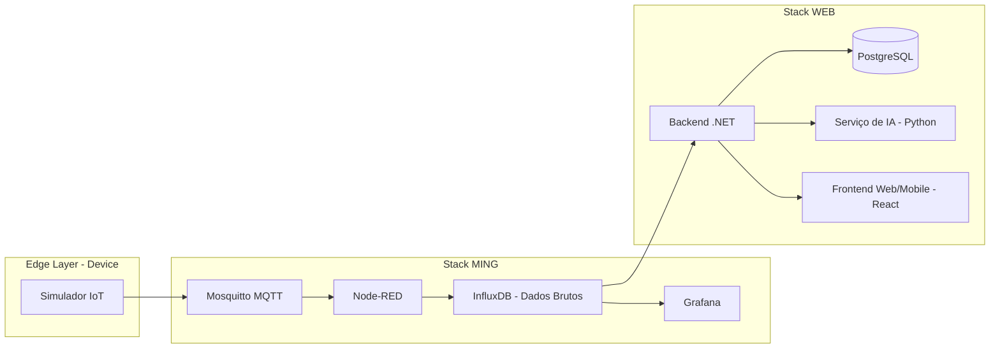

# Sistema ACE — Plataforma Industrial (IoT + Web + IA)

## Visão Geral

O sistema **ACE (Automação e Controle de Eventos)** é uma plataforma distribuída que simula um ambiente industrial completo, integrando:

- IoT industrial (simulação de produção e logística)
- Processamento de eventos em tempo real
- Persistência de dados em múltiplas camadas
- APIs corporativas (ERP-like)
- Interface web e mobile
- Serviço de recomendação com IA

---

## Arquitetura Geral

O sistema é composto por aplicações independentes orquestradas via Docker Compose.



---

## Camadas do Sistema

### 1. Stack IoT (MING)

Responsável pela captura e persistência de dados brutos.

| Componente       | Função                            |
| ---------------- | --------------------------------- |
| MQTT (Mosquitto) | Broker de mensagens               |
| Node-RED         | Processamento de eventos          |
| InfluxDB         | Armazenamento de séries temporais |
| Grafana          | Visualização operacional          |

> Essa camada lida com dados em tempo real de produção e logística.

---

### 2. Stack Web (Negócio)

Responsável pela consolidação e modelagem de dados.

| Componente     | Função                       |
| -------------- | ---------------------------- |
| Backend (.NET) | API REST e regras de negócio |
| PostgreSQL     | Dados estruturados (ERP)     |

Funções principais:

* Consolidação de dados do InfluxDB
* Gestão de clientes, pedidos e veículos
* Exposição de APIs para frontend
* Integração com IA

---

### 3. Inteligência Artificial

Serviço independente responsável por recomendações.

* Sugestão de peças e acessórios
* Recomendações baseadas em perfil do cliente
* Consumo via API pelo backend

---

### 4. Frontend

Interface única do sistema.

* Consome apenas o backend
* Não acessa bancos diretamente
* Exibe:

  * Produção
  * Serviços
  * Vendas de peças
  * Perfil do cliente

---

## Domínios Funcionais

### Produção

* Linha de montagem
* Status de veículos
* Etapas industriais
* Rastreamento de fabricação

### Serviços

* Ordens de manutenção
* Serviços técnicos
* Peças associadas a reparos

### Vendas de Peças (B2C)

* Catálogo de peças automotivas
* Carrinho de compras
* Pedido de consumidor final
* Histórico de compras

---


## Serviços e Portas

| Serviço          | Porta      |
| ---------------- | ---------- |
| MQTT (Mosquitto) | 1883       |
| Node-RED         | 1880       |
| InfluxDB         | 8086       |
| Grafana          | 3000       |
| PostgreSQL       | 5432       |
| Backend (.NET)   | 5000       |
| IA (Python)      | 8000       |
| Frontend (React) | 80         |

---

## Princípios Arquiteturais

* Separação total entre IoT e sistema de negócio
* Backend como única camada de integração
* Frontend desacoplado de qualquer banco de dados
* IA como serviço independente
* Comunicação baseada em APIs e eventos
* Arquitetura orientada a serviços (SOA)

---

## Tipos de Dados

### IoT (InfluxDB)

* Eventos de produção
* Eventos logísticos
* Dados em tempo real

### Negócio (PostgreSQL)

* Clientes
* Pedidos
* Serviços
* Peças
* Veículos

---

## Objetivo do Sistema

Este projeto simula um ambiente industrial completo com foco em:

* Indústria 4.0
* Integração IoT + ERP
* Arquitetura distribuída moderna
* Sistemas orientados a eventos
* Inteligência aplicada a recomendação de produtos

---

## Execução

```bash
docker compose up -d
```

---

## Observações

* Cada aplicação possui seu próprio README detalhado
* Este documento descreve apenas a arquitetura global
* O sistema foi projetado para fins educacionais e simulação industrial
