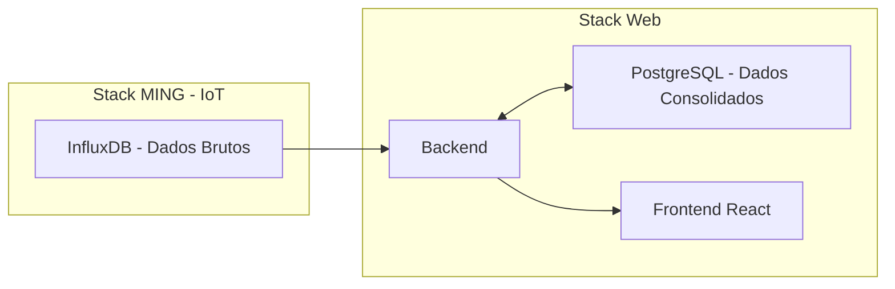

# Frontend Web — Plataforma Industrial (Produção, Serviços e Vendas)

## Visão Geral

Este projeto representa o **frontend da plataforma web corporativa** do ecossistema SENAI ACE.

A aplicação consolida dados operacionais e comerciais vindos de sistemas industriais e IoT, permitindo a visualização e interação com:

- Produção industrial (linha de montagem)
- Serviços de manutenção
- Venda de peças para consumidores finais
- Gestão de pedidos e histórico de clientes

---

## Arquitetura Geral

O sistema é dividido em duas camadas principais:

### Stack MING (IoT / Dados Brutos)

Responsável por:

- Captura de eventos industriais via MQTT
- Processamento em Node-RED
- Armazenamento de dados brutos no InfluxDB

> Esta camada NÃO é acessada diretamente pelo frontend.

---

### Stack Web (Camada de Negócio)

Responsável por:

- Leitura dos dados do InfluxDB
- Consolidação e modelagem de dados
- Persistência estruturada no PostgreSQL
- Exposição via API REST

O frontend consome **somente a API da Stack Web**.

---

## Domínios da Aplicação

A aplicação cobre três grandes áreas:

### Produção
- Acompanhamento de linha de produção
- Status de veículos
- Etapas industriais
- Histórico de fabricação

### Serviços
- Ordens de manutenção
- Atendimento técnico
- Serviços associados a veículos
- Histórico de intervenções

### Vendas de Peças (B2C)
- Catálogo de peças
- Compra por consumidores finais
- Associação de peças a serviços
- Histórico de compras

---

## Tecnologias

- React 18
- React Router v6
- Axios
- Context API (auth)
- Vite
- CSS Modules

---

## Estrutura do Projeto

```

frontend/
├── public/
│   └── index.html
│
├── src/
│   ├── api/                     # Integração com backend (Postgres API)
│   │   ├── axios.js
│   │   ├── authApi.js
│   │   ├── productionApi.js
│   │   ├── serviceApi.js       # Serviços / manutenção
│   │   ├── partsApi.js        # Venda de peças
│   │   └── ordersApi.js
│   │
│   ├── components/
│   │   ├── Header.jsx
│   │   ├── PrivateRoute.jsx
│   │   ├── ProductionTimeline.jsx
│   │   ├── ServiceCard.jsx
│   │   └── PartsCard.jsx
│   │
│   ├── contexts/
│   │   └── AuthContext.jsx
│   │
│   ├── pages/
│   │   ├── Login/
│   │   ├── Register/
│   │   ├── Home/
│   │   ├── Profile/
│   │   │
│   │   ├── Production/
│   │   │   └── ProductionDetail.jsx
│   │   │
│   │   ├── Services/
│   │   │   ├── ServiceList.jsx
│   │   │   └── ServiceDetail.jsx
│   │   │
│   │   ├── Parts/
│   │   │   ├── PartsCatalog.jsx
│   │   │   ├── PartsDetail.jsx
│   │   │   └── Cart.jsx
│   │   │
│   │   └── Orders/
│   │       ├── OrderList.jsx
│   │       └── OrderDetail.jsx
│   │
│   ├── routes/
│   │   └── AppRoutes.jsx
│   │
│   ├── App.jsx
│   └── main.jsx
│
├── .env.example
├── .env
├── package.json
└── vite.config.js

````

---

## Configuração

```bash
cp .env.example .env
````

```env
VITE_API_URL=http://localhost:80
```

---

## Execução

### Local

```bash
npm install
npm run dev
```

## Módulos da Interface

### Produção

* Status de veículos
* Timeline de produção
* Histórico por chassi

### Serviços

* Ordens de manutenção
* Diagnóstico técnico
* Associação com peças utilizadas

### Peças (B2C)

* Catálogo de peças automotivas
* Carrinho de compras
* Histórico de pedidos
* Associação com serviços

---

## Fluxo de Dados



---

## Autenticação

* JWT armazenado em `localStorage`
* Interceptor Axios adiciona token automaticamente
* Rotas protegidas via `PrivateRoute`

---

## Regras Arquiteturais

* Frontend NÃO acessa InfluxDB diretamente
* Frontend NÃO acessa MQTT
* Frontend NÃO acessa Node-RED
* Apenas consome API da Stack Web
* Separação entre:

  * dados brutos (IoT)
  * dados de negócio (Postgres)

---

## Princípios de Desenvolvimento

* Separação de responsabilidades (UI x API)
* Componentes reutilizáveis
* Páginas desacopladas
* API centralizada em `/api`
* Estado global apenas para autenticação
* UI orientada a domínio (produção, serviços, vendas)

---

## Uso Educacional

Este frontend é utilizado para ensino de:

* Arquitetura moderna de sistemas web industriais
* Integração de IoT com sistemas corporativos
* Separação de camadas (Edge / Data / Business / UI)
* Modelagem de sistemas ERP industriais
* E-commerce integrado com manufatura
