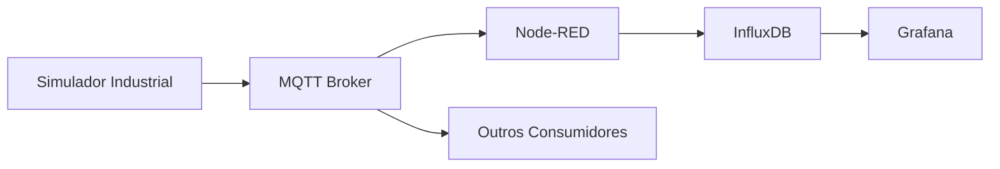

# SENAI ACE — MQTT Broker (Mosquitto)

## Sobre o Serviço

Este módulo representa o **broker MQTT** utilizado no ecossistema SENAI ACE para comunicação entre os sistemas de simulação, processamento e análise de dados.

Ele atua como o **barramento central de mensagens**, permitindo comunicação assíncrona entre os componentes da arquitetura IIoT.

---

## Objetivo

O broker MQTT tem como finalidade:

- Receber mensagens do simulador industrial
- Distribuir eventos para consumidores (Node-RED)
- Garantir comunicação leve e em tempo real
- Suportar arquitetura orientada a eventos
- Servir como middleware de IoT

---

## Configuração

O broker está configurado com o seguinte arquivo:

```conf id="mqttcfg"
listener 1883
allow_anonymous true
persistence false
````

---

## Explicação da Configuração

### 📡 Porta de Escuta

```
listener 1883
```

* Define a porta padrão do MQTT
* Porta padrão do protocolo MQTT
* Utilizada para comunicação entre dispositivos e serviços

---

### Acesso Anônimo

```
allow_anonymous true
```

* Permite conexão sem autenticação
* Simplifica ambiente educacional
* Ideal para simulações e testes
* Não recomendado para produção

---

### Persistência

```
persistence false
```

* Desativa armazenamento de mensagens no disco
* Broker não mantém histórico após reinício
* Reduz consumo de recursos
* Adequado para simulações em tempo real

---

## Arquitetura de Comunicação



---

## Tópicos Utilizados

### Produção

```
senai/producao/linha
```

### Logística

```
senai/logistica/entrega
```

---

## Função no Ecossistema

O MQTT atua como:

* Middleware de comunicação entre sistemas
* Ponto central de integração IoT
* Transporte de eventos industriais
* Base da arquitetura orientada a eventos

---

## Tecnologias

* Eclipse Mosquitto
* Protocolo MQTT v3.1.1
* Port 1883 TCP

---

## Uso Educacional

Este broker é utilizado para ensino de:

* Comunicação MQTT em IoT
* Arquiteturas pub/sub
* Sistemas distribuídos
* Integração de dispositivos e serviços
* Fundamentos de IIoT (Industrial IoT)

---

## Observações

* Configuração simplificada para ambiente educacional
* Não possui autenticação por padrão
* Não persiste mensagens após reinicialização
* Pode ser expandido com TLS e usuários para produção