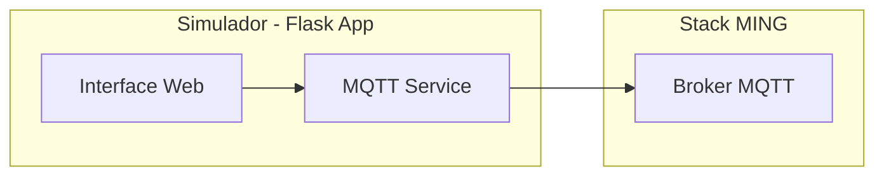

# SENAI ACE — Simulador Industrial (Flask + MQTT)

## Sobre o Simulador

Este projeto representa o **módulo de simulação** de um ambiente industrial e logístico utilizado para fins educacionais.

O simulador é responsável por **gerar eventos** que representam:

* Operações de uma linha de produção
* Processos logísticos de despacho e entrega

Esses eventos são publicados em um broker MQTT, permitindo sua integração com outras ferramentas do ecossistema (processamento, armazenamento e visualização).

---

## Objetivo

O simulador tem como finalidade:

* Gerar dados simulados de forma controlada
* Permitir envio manual e automático de eventos
* Servir como fonte de dados para pipelines baseados em MQTT
* Apoiar o ensino de arquiteturas orientadas a eventos

---

## Funcionalidades

### Linha de Produção

* Entrada manual de veículos (chassi)
* Geração automática de eventos em intervalo configurável
* Simulação de estados:

  * Fila
  * Em processamento
  * Finalizados
* Publicação no tópico:

```
senai/producao/linha
```

---

### Logística e Entrega

* Simulação de envio de:

  * Veículos
  * Peças
* Definição de destino
* Envio manual ou automático
* Publicação no tópico:

```
senai/logistica/entrega
```

---

### Log de Eventos

* Visualização de eventos gerados
* Filtro por tipo:

  * Produção
  * Logística
* Limpeza de logs

---

## Arquitetura do Simulador

O simulador atua como **produtor de eventos MQTT**:



---

## Estrutura do Projeto

```text
senai_app/
├── run.py
├── requirements.txt
├── app/
│   ├── __init__.py
│   ├── config.py
│   ├── state.py
│   ├── routes/
│   │   ├── views.py
│   │   ├── producao.py
│   │   └── logistica.py
│   ├── services/
│   │   ├── mqtt_service.py
│   │   ├── producao_service.py
│   │   └── logistica_service.py
│   ├── static/
│   │   ├── css/
│   │   │   └── style.css
│   │   └── js/
│   │       └── app.js
│   └── templates/
│       └── index.html
```

---

## Organização do Código

* `run.py`
  Ponto de entrada da aplicação

* `__init__.py`
  Factory do Flask (criação da aplicação)

* `config.py`
  Configurações gerais (MQTT, parâmetros, etc.)

* `state.py`
  Gerenciamento de estado em memória

* `routes/`
  Endpoints HTTP:

  * Interface web
  * APIs de produção e logística

* `services/`
  Regras de negócio:

  * Publicação MQTT
  * Simulação de produção
  * Simulação logística

* `static/`
  Arquivos de frontend (CSS e JavaScript)

* `templates/`
  Interface HTML

---

## Execução

### Instalação

```bash
pip install -r requirements.txt
```

### Execução

```bash
python run.py
```

A aplicação estará disponível em:

```
http://localhost:5000
```

---

## Integração com MQTT

O simulador publica eventos em dois tópicos principais:

* Produção:

```
senai/producao/linha
```

* Logística:

```
senai/logistica/entrega
```

Os payloads são enviados em formato JSON.

---

## Uso Educacional

Este simulador pode ser utilizado para:

* Demonstrar geração de eventos em tempo real
* Testar consumidores MQTT (Node-RED, scripts, etc.)
* Simular cenários industriais sem necessidade de hardware
* Apoiar aulas práticas de IoT e sistemas distribuídos

---

## Observações

* Este repositório contém apenas o simulador
* A infraestrutura completa (MQTT, Node-RED, InfluxDB, Grafana) é descrita em outro projeto
* O simulador pode ser utilizado de forma independente, desde que exista um broker MQTT disponível
